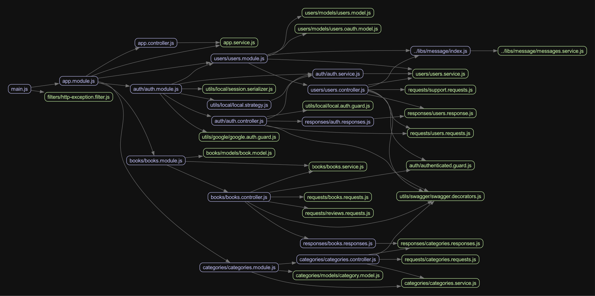

# Nodebook

## 📝 Опис проєкту

Цей проєкт — це книжковий форум, який дозволяє користувачам переглянути книги з їх описом та відгуками від інших користувачів, і можливість вподобати улюблені книги.

## Діаграма компонентів серверного застосунку:

# Виконані лабораторні роботи:

- Лаб 1 (Виконано)
- Лаб 2
  - Файли
    - [eslinterc](https://github.com/DreammyOleksandr/nodebook-server/blob/main/.eslintrc.js)
    - [prettierrc](https://github.com/DreammyOleksandr/nodebook-server/blob/main/.prettierrc)
    - [commit-msg](https://github.com/DreammyOleksandr/nodebook-server/blob/main/.husky/commit-msg)
    - [pre-push](https://github.com/DreammyOleksandr/nodebook-server/blob/main/.husky/pre-push)
    - [pre-commit](https://github.com/DreammyOleksandr/nodebook-server/blob/main/.husky/pre-commit)
- Лаб 3 (Структура застосунку описана в діаграмі компонентів вище)
- Лаб 4/5 (Основні сценарії були імплементовані успішно з моковими даними (не пушились до Github). Зараз ж застосунок працює з підключеною до нього бд Mongo)
- Лаб 6
  - Модуль, покритий UNIT-тестами: [categories.controller](https://github.com/DreammyOleksandr/nodebook-server/blob/main/src/categories/categories.controller.spec.ts) [categories.service](https://github.com/DreammyOleksandr/nodebook-server/blob/main/src/categories/categories.service.spec.ts)
  - Інші файли UNIT-тестів: [users.service](https://github.com/DreammyOleksandr/nodebook-server/blob/main/src/users/users.service.spec.ts) [users.controller](https://github.com/DreammyOleksandr/nodebook-server/blob/main/src/users/users.controller.spec.ts)
  - E2E тестування: [app.e2e](https://github.com/DreammyOleksandr/nodebook-server/blob/main/test/app.e2e-spec.ts)
 - Лаб 7
   - [Сторінка CI](https://github.com/DreammyOleksandr/nodebook-server/actions)
   - Налаштований [.yml](https://github.com/DreammyOleksandr/nodebook-server/blob/main/.github/workflows/nestjs.yml)
   - Сервіс доступний з інтернету за [посиланням](https://nodebook-b4axckeya0abe4aq.germanywestcentral-01.azurewebsites.net/swagger)
- Лаб 8/9
  - Модуль [message](https://github.com/DreammyOleksandr/nodebook-server/tree/main/libs/message) був винесений в окрему бібліотеку та відрефакторений.
  - Увесь проєкт початково писався на TS.

### 👨‍💻 Основні функції:

- **✍️ Реєстрація та авторизація**:

  - Реєстрація через логін і пароль (credentials).

- **📋🔍 Фільтрування та пошук книг**:

  - Користувачі можуть фільтрувати книги за жанрами.
  - Книги можна буде знайти за автором чи назвою у пошуковій системі.

- **👍❤️ Вподобання**:
  - Можливість поставити вподобання на улюблені книги.
  - Кожну вподобану книгу користувач може переглянути у своєму профілі.
- **💬 Коментарі щодо книг**:
  - Користувачі можуть залишити відгук (коментар) щодо книги.
  - Користувачі зможуть переглянути опис книги та коментарі інших користувачів щодо неї.

## 💻 Технології

- **⌨️ Backend**:

  - Nest.js
  - MongoDB (база даних)
  - Jest

- **🖥 Frontend**:

  - Next.js
  - Tailwind CSS (для стилізації)
  - TypeScript
  - Jest
  - Playwright

- **🤖 Інтеграції**:
  - Nodemailer для надсилання повідомлень на пошту (а саме gmail).
